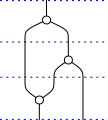

.. _page-json_format:

.. highlight:: JSON

JSON format
===========

We explain here the JSON format used to represent the morphisms.
The first step to understand the format is to explain the data
structure we use to represent `monoidal string diagrams <https://en.wikipedia.org/wiki/String_diagram>`_.
These are  simpler than bimonoidal diagrams as they can be drawn in the plane.

Data structure for monoidal string diagrams
-------------------------------------------

A string diagrams in a monoidal category is in *general position* when no two nodes share the same height.
Any string diagram can be put in general position without changing its meaning.

A diagram in general position can be decomposed as a sequence of horizontal *slices*, each of which
contains exactly one node.

One can therefore encode the diagram as follows:

* The number of wires crossing the input boundary (or a list of the objects annotating them, in a typed context);
* The list of slices, each of which can be described by the following data:

 + The number of wires passing to the left of the node in the slice. We call this the *offset*;
 + The number of input wires consumed by the node;
 + The number of output wires produced by the node (or again, their list of types).

Therefore, one can encode the sample diagram above as follows, assuming that inputs are at the top::

   {
     "inputs": 1,
     "slices": [
       { "offset": 0, "inputs": 1, "outputs": 2 },
       { "offset": 1, "inputs": 1, "outputs": 2 },
       { "offset": 0, "inputs": 2, "outputs": 1 }
     ]
   }

Each slice can be augmented to store details about the morphism in that slice (such as a label, for instance).
This data structure is well suited to reason about string diagrams and there are efficient algorithms to determine
if two diagrams are equivalent up to exchanges.

For more details about this data structure, refer to:

* Antonin Delpeuch and Jamie Vicary. `Normalization for planar string diagrams and a quadratic equivalence algorithm <https://arxiv.org/pdf/1804.07832.pdf>`_, 2018, `arXiv:1804.07832 <https://arxiv.org/abs/1804.07832>`_.

Bimonoidal diagrams
-------------------

Sheet diagrams in bimonoidal categories are obtained by extruding monoidal string diagrams for
the additive monoidal structure :math:`(\mathcal{C}, \oplus, O)`.
Therefore our data structure for bimonoidal diagrams is based on that for monoidal diagrams.

A bimonoidal diagram is described by:

* The number of input sheets, and the number of input wires on each of these input sheets;
* The slices of the bimonoidal diagram, which are seams between sheets. They are each described by:

  + The number of sheets passing to the left of the seam. We call this, again, the *offset*;
  + The number of input sheets joined by the seam;
  + The number of output sheets produced by the seam;
  + The nodes present on the seam.

Each seam can have multiple nodes on it. Each of these can connect to some wires on each input sheet
(not necessarily the same number of wires for each input sheet) and similarly for output sheets.
We describe them with the following data:

* The number of wires passing through the seam without touching a node, to the left of the node being
  described. We call this the *offset* of the node;
* For each input sheet, the number of wires connected to the node;
* For each output sheet, the number of wires connected to the node.

