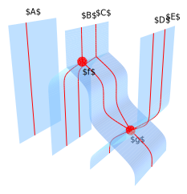
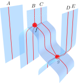

.. _page-latex:

.. highlight:: latex

Embedding diagrams in LaTeX
===========================

We explain here the recommended workflow to embed diagrams generated by SheetShow in
:math:`\LaTeX` documents.

Workflow overview
-----------------

 * Compose your diagram in SheetShow. If you need to use mathematical expressions in labels, use `label: $\\\\alpha$`. The two dollars enable the math mode.
 * Export your diagram as SVG in SheetShow.
 * Use Inkscape to convert your diagram to LaTeX+PDF
 * Embed the generated LaTeX file in your document with `\\input`.

Inkscape
--------

`Inkscape <https://inkscape.org/>`_ is an open source vector graphics editor, available on most platforms.
It can be used as a command line tool to convert between different vector and raster image formats.
In our case, we use it to convert from SVG to :math:`\LaTeX` as follows (for Inkscape 0.92)::

   inkscape -D -z --file=sheet_diagram.svg --export-pdf=sheet_diagram.pdf --export-latex --export-area-drawing

For Inkscape 1.0, the syntax will be changed to::

   inkscape -D sheet_diagram.svg --export-file=sheet_diagram.pdf --export-latex --export-area-drawing

When invoked like this, Inkscape will generate two files:

* One PDF file, which contains all the surfaces and paths in the SVG, without the text nodes;
* One LaTeX file, which imports the PDF and adds the text nodes on top of it.

Let us take the following diagram as example:

It is converted to a PDF file where different layers in the picture are split into pages, and the accompanying LaTeX code is generated::

    %% Creator: Inkscape inkscape 0.92.4, www.inkscape.org
    %% PDF/EPS/PS + LaTeX output extension by Johan Engelen, 2010
    %% Accompanies image file 'sheet_diagram.pdf' (pdf, eps, ps)
    %%
    %% To include the image in your LaTeX document, write
    %%   \input{<filename>.pdf_tex}
    %%  instead of
    %%   \includegraphics{<filename>.pdf}
    %% To scale the image, write
    %%   \def\svgwidth{<desired width>}
    %%   \input{<filename>.pdf_tex}
    %%  instead of
    %%   \includegraphics[width=<desired width>]{<filename>.pdf}
    %%
    %% Images with a different path to the parent latex file can
    %% be accessed with the `import' package (which may need to be
    %% installed) using
    %%   \usepackage{import}
    %% in the preamble, and then including the image with
    %%   \import{<path to file>}{<filename>.pdf_tex}
    %% Alternatively, one can specify
    %%   \graphicspath{{<path to file>/}}
    %% 
    %% For more information, please see info/svg-inkscape on CTAN:
    %%   http://tug.ctan.org/tex-archive/info/svg-inkscape
    %%
    \begingroup%
    \makeatletter%
    \providecommand\color[2][]{%
        \errmessage{(Inkscape) Color is used for the text in Inkscape, but the package 'color.sty' is not loaded}%
        \renewcommand\color[2][]{}%
    }%
    \providecommand\transparent[1]{%
        \errmessage{(Inkscape) Transparency is used (non-zero) for the text in Inkscape, but the package 'transparent.sty' is not loaded}%
        \renewcommand\transparent[1]{}%
    }%
    \providecommand\rotatebox[2]{#2}%
    \newcommand*\fsize{\dimexpr\f@size pt\relax}%
    \newcommand*\lineheight[1]{\fontsize{\fsize}{#1\fsize}\selectfont}%
    \ifx\svgwidth\undefined%
        \setlength{\unitlength}{159.7625407bp}%
        \ifx\svgscale\undefined%
        \relax%
        \else%
        \setlength{\unitlength}{\unitlength * \real{\svgscale}}%
        \fi%
    \else%
        \setlength{\unitlength}{\svgwidth}%
    \fi%
    \global\let\svgwidth\undefined%
    \global\let\svgscale\undefined%
    \makeatother%
    \begin{picture}(1,1.04467035)%
        \lineheight{1}%
        \setlength\tabcolsep{0pt}%
        \put(0,0){\includegraphics[width=\unitlength,page=1]{sheet_diagram.pdf}}%
        \put(0.10097764,1.00588598){\color[rgb]{0,0,0}\makebox(0,0)[lt]{\lineheight{1.25}\smash{\begin{tabular}[t]{l}$A$\end{tabular}}}}%
        \put(0,0){\includegraphics[width=\unitlength,page=2]{sheet_diagram.pdf}}%
        \put(0.71548248,0.25671683){\color[rgb]{0,0,0}\makebox(0,0)[lt]{\lineheight{1.25}\smash{\begin{tabular}[t]{l}$g$\end{tabular}}}}%
        \put(0,0){\includegraphics[width=\unitlength,page=3]{sheet_diagram.pdf}}%
        \put(0.51339268,1.00002171){\color[rgb]{0,0,0}\makebox(0,0)[lt]{\lineheight{1.25}\smash{\begin{tabular}[t]{l}$C$\end{tabular}}}}%
        \put(0,0){\includegraphics[width=\unitlength,page=4]{sheet_diagram.pdf}}%
        \put(0.4355847,0.65279324){\color[rgb]{0,0,0}\makebox(0,0)[lt]{\lineheight{1.25}\smash{\begin{tabular}[t]{l}$f$\end{tabular}}}}%
        \put(0,0){\includegraphics[width=\unitlength,page=5]{sheet_diagram.pdf}}%
        \put(0.42783026,0.98479786){\color[rgb]{0,0,0}\makebox(0,0)[lt]{\lineheight{1.25}\smash{\begin{tabular}[t]{l}$B$\end{tabular}}}}%
        \put(0,0){\includegraphics[width=\unitlength,page=6]{sheet_diagram.pdf}}%
        \put(0.92302724,0.97646438){\color[rgb]{0,0,0}\makebox(0,0)[lt]{\lineheight{1.25}\smash{\begin{tabular}[t]{l}$E$\end{tabular}}}}%
        \put(0.85543138,0.95720957){\color[rgb]{0,0,0}\makebox(0,0)[lt]{\lineheight{1.25}\smash{\begin{tabular}[t]{l}$D$\end{tabular}}}}%
    \end{picture}%
    \endgroup%

We can then include the diagram in a :math:`\LaTeX` document as::

   \input{sheet_diagram.pdf_tex}

This produces the following output:

The generated :math:`\LaTeX` file require the `graphicx` and `color` packages. To render a minimal document with :math:`\LaTeX`, you can use the following template::

   \documentclass{standalone}
   \usepackage{graphicx}
   \usepackage{color}
   \begin{document}
   \input{sheet_diagram.pdf_tex}
   \end{document}

Automation
----------

It is reportedly possible to automate the conversion, making it possible to include the SVG files in :math:`\LaTeX` directly.
For this, use the `svg package <https://ctan.org/pkg/svg>`_ from CTAN, which wraps Inkscape nicely. You will need to run `pdflatex` in `--shell-escape` mode for it to be able to call Inkscape.

Alternative workflows
---------------------

We could also render mathematical formulae in JavaScript. `MathJax supports SVG rendering <http://docs.mathjax.org/en/latest/output/svg.html>`_, `KaTeX does not yet <https://github.com/KaTeX/KaTeX/issues/375>`_.

This would have the advantage of producing more readable rendering in web pages.

