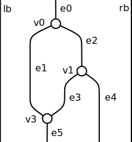

.. _page-rendering:

Rendering
=========

We describe the architecture behind the renderer.

Monoidal diagrams
-----------------

We use the following layout strategy to compute the geometry of monoidal diagrams.
Each diagram slice has a fixed height: the horizontal spacing between two adjacent nodes is constant.
Each edge is drawn as a straight vertical wire, except towards the ends where splines bind them to the nodes they connect to.

To determine the horizontal position of nodes and edges, we generate a system of linear equations and inequations.
We assign a variable to each node and each edge, denoting their horizontal positions. We also add variables for the positions of the left and right boundaries:

We then generate the system of constraints using the following rules:
 * At a given level in the diagram, between two consecutive slices, consecutive wires must be spaced by at least a fixed margin. The first and last wire must also be spaced away from the boundary of the drawing rectangle.
 * Each node must be positioned at the average position of all its input wires, which must also be equal to the average position of all its output wires.
 * Nodes with no inputs or outputs (known as *scalars*) must be located between the wires passing to the left and to the right of them.
We minimize the sum of all variables involved under these constraints.

For the diagram above, this gives the following constraint system:

.. math::

    lb + m \leq e_0

    e_0 + m \leq rb
    
    v_0 = e_0

    v_0 = \frac{e_1 + e_2}{2}

    lb + m \leq e_1
 
    e_1 + s \leq e_2
    
    e_2 + m \leq rb

    v_1 = e_2

    v_1 = \frac{e_3 + e_4}{2}

    e_1 + s \leq e_3

    e_3 + s \leq e_4
 
    e_4 + m \leq rb

    v_3 = \frac{e_1 + e_3}{2}

    v_3 = e_5

    lb + m \leq e_5

    e_5 + s \leq e_4

This system can then be solved using an off-the-shelf solver (we use `Glpk.js <https://github.com/jvail/glpk.js>`_ currently).
The solutions to the system determine the horizontal positions of all objects in the diagram: we just need to link up edges to nodes
using Bezier curves, and we can render all this in SVG.

It would be nice to have a proof that the constraint system is always satisfiable.

Bimonoidal diagrams
-------------------

The basic 3D shape of bimonoidal diagrams is obtained by extruding a monoidal diagram, so we can use the same constraint system to compute this basic layout. Then, we need to determine the position of paths on the sheets. This is again done using a
constraint system, which can be solved independently of the first one.

Again, we assume that paths are straight lines drawn on the sheets, except at the ends where Bezier curves are used to link them to the nodes they connect to. We add the same spacing constraint on any two paths embedded in the same sheet. To link paths to
vertices, we have two options:
 * the *strict mode*, where nodes are required to be positioned at the average of paths connecting to it in a given sheet, for all input and output sheets;
 * the *lax mode*, where instead nodes are required to be positioned at the average of all their input paths which must be equal to the average of all their output paths.

The strict mode generally gives visually pleasing results, but it is not solvable for all diagrams. Consider `the following diagram <https://wetneb.github.io/sheetshow/#eyJpbnB1dHMiOlsxXSwic2xpY2VzIjpbeyJvZmZzZXQiOjAsImlucHV0cyI6MSwib3V0cHV0cyI6Miwibm9kZXMiOlt7Im9mZnNldCI6MCwiaW5wdXRzIjpbMV0sIm91dHB1dHMiOlsxLDFdfV19LHsib2Zmc2V0IjoxLCJpbnB1dHMiOjEsIm91dHB1dHMiOjEsIm5vZGVzIjpbeyJvZmZzZXQiOjAsImlucHV0cyI6WzBdLCJvdXRwdXRzIjpbMV19XX0seyJvZmZzZXQiOjEsImlucHV0cyI6MSwib3V0cHV0cyI6MSwibm9kZXMiOlt7Im9mZnNldCI6MCwiaW5wdXRzIjpbMl0sIm91dHB1dHMiOlsxXX1dfSx7Im9mZnNldCI6MCwiaW5wdXRzIjoyLCJvdXRwdXRzIjoxLCJub2RlcyI6W3sib2Zmc2V0IjowLCJpbnB1dHMiOlsxLDFdLCJvdXRwdXRzIjpbMV19XX1dfQ==>`_:

It would be impossible to lay out this diagram with the strict mode.

When rendering a diagram, the renderer tries to solve its strict constraint system first, and falls back on the lax constraint system if that fails.

It would be nice to have a proof that the lax constraint system is always satisfiable, or a counter-example of that.

Geometry rendering
------------------

Once both constraint systems have been generated and solved, we generate the 3D geometry according to the coordinates induced by the solutions. To generate 3D models, Bezier curves are discretized to generate faces.

We then render the model with the `Seen <http://seenjs.io/>`_ 3D renderer, which produces an SVG image of the model.

