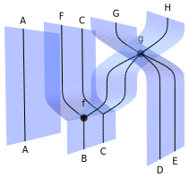

.. _page-json_format:

.. highlight:: YAML

YAML format
===========

We explain here the YAML format used to represent the morphisms.
The first step to understand the format is to explain the data
structure we use to represent `monoidal string diagrams <https://en.wikipedia.org/wiki/String_diagram>`_.
These are  simpler than bimonoidal diagrams as they can be drawn in the plane.

Data structure for monoidal string diagrams
-------------------------------------------

A string diagrams in a monoidal category is in *general position* when no two nodes share the same height.
Any string diagram can be put in general position without changing its meaning.

A diagram in general position can be decomposed as a sequence of horizontal *slices*, each of which
contains exactly one node.

.. image:: monoidal_diagram.svg
    :align: center

One can therefore encode the diagram as follows:

* The number of wires crossing the input boundary (or a list of the objects annotating them, in a typed context);
* The list of slices, each of which can be described by the following data:

 + The number of wires passing to the left of the node in the slice. We call this the *offset*;
 + The number of input wires consumed by the node;
 + The number of output wires produced by the node (or again, their list of types).

Therefore, one can encode the sample diagram above as follows, assuming that inputs are at the bottom::

   inputs: 2
   slices:
   - offset: 0
     inputs: 1
     outputs: 2
   - offset: 1
     inputs: 2
     outputs: 1
   - offset: 0
     inputs: 2
     outputs: 1

Each slice can be augmented to store details about the morphism in that slice (such as a label, for instance).
This data structure is well suited to reason about string diagrams and there are efficient algorithms to determine
if two diagrams are equivalent up to exchanges.

For more details about this data structure, refer to:

* Antonin Delpeuch and Jamie Vicary. `Normalization for planar string diagrams and a quadratic equivalence algorithm <https://arxiv.org/pdf/1804.07832.pdf>`_, 2018, `arXiv:1804.07832 <https://arxiv.org/abs/1804.07832>`_.

Adding symmetry
---------------

To obtain a language for symmetric monoidal categories, we do not need to add much.
We can simply allow a particular type of slice which represent a swap of two adjacent wires.
To simplify the format, instead of writing the swap fully as::

   offset: 3
   inputs: 2
   outputs: 2

We introduce a shorter notation, which at the same time encodes the particular role of the symmetry::

   swap: 3

It now becomes possible to encode symmetric monoidal diagrams::

   inputs: 2
   slices:
   - offset: 0
     inputs: 1
     outputs: 2
   - swap: 1
   - offset: 1
     inputs: 2
     outputs: 1
   - offset: 0
     inputs: 2
     outputs: 1

Which can be rendered as:

Bimonoidal diagrams
-------------------

Sheet diagrams in bimonoidal categories are obtained by extruding symmetric monoidal string diagrams for
the additive monoidal structure :math:`(\mathcal{C}, \oplus, O)`.
Therefore our data structure for bimonoidal diagrams is based on that for monoidal diagrams.

A bimonoidal diagram is described by:

* The number of input sheets, and the number of input wires on each of these input sheets (in the example above: `[1, 2, 2]` at the bottom);
* The slices of the bimonoidal diagram, which are seams between sheets. They are each described by:

  + The number of sheets passing to the left of the seam. We call this, again, the *offset*;
  + The number of input sheets joined by the seam;
  + The number of output sheets produced by the seam;
  + The nodes present on the seam.

Each seam can have multiple nodes on it. Each of these can connect to some wires on each input sheet
(not necessarily the same number of wires for each input sheet) and similarly for output sheets.
We describe them with the following data:

* The number of wires passing through the seam without touching a node, to the left of the node being
  described. We call this the *offset* of the node;
* For each input sheet, the number of wires connected to the node;
* For each output sheet, the number of wires connected to the node.

Which is encoded in YAML as::

   inputs:
   - 1
   - 2
   - 2
   slices:
   - offset: 1
     inputs: 1
     outputs: 2
     nodes:
     - offset: 0
       inputs:
       - 1
       outputs:
       - 1
       - 1
   - offset: 2
     inputs: 2
     outputs: 2
     nodes:
     - offset: 0
       inputs:
       - 2
       - 2
       outputs:
       - 1
       - 1

`View in SheetShow
<https://wetneb.github.io/sheetshow/#eyJpbnB1dHMiOlsxLDIsMl0sInNsaWNlcyI6W3sib2Zmc2V0IjoxLCJpbnB1dHMiOjEsIm91dHB1dHMiOjIsIm5vZGVzIjpbeyJvZmZzZXQiOjAsImlucHV0cyI6WzFdLCJvdXRwdXRzIjpbMSwxXX1dfSx7Im9mZnNldCI6MiwiaW5wdXRzIjoyLCJvdXRwdXRzIjoyLCJub2RlcyI6W3sib2Zmc2V0IjowLCJpbnB1dHMiOlsyLDJdLCJvdXRwdXRzIjpbMSwxXX1dfV19>`_.

Symmetry for the multiplicative structure
-----------------------------------------

Symmetry is also supported for the multiplicative (although it is not required in bimonoidal
categories in general). It can be used as a special node (for which you will need to introduce a seam)::

   inputs:
   - 2
   slices:
   - offset: 0
     inputs: 1
     outputs: 1
     nodes:
     - swap: 0

`View in SheetShow <https://wetneb.github.io/sheetshow/#eyJpbnB1dHMiOlsyXSwic2xpY2VzIjpbeyJvZmZzZXQiOjAsImlucHV0cyI6MSwib3V0cHV0cyI6MSwibm9kZXMiOlt7InN3YXAiOjB9XX1dfQ==>`_.

As for the additive symmetry, the value of the `swap` attribute is the offset of the corresponding node.

Typing and labeling
-------------------

Rendering the geometry of a diagram is not enough: we also want to be able to annotate
its nodes and and edges with morphisms and objects.

At the moment only wires on the diagram boundary can be labeled by objects. For inputs,
it is done by replacing the number of wires on an input sheet by the list of types, as follows::

    inputs:
    - [A]
    - [B,C]
    - [D,E]

or equivalently::

    inputs:
    - - A
    - - B
      - C
    - - D
      - E

The same syntaxes can be used for outputs::

    outputs:
    - []
    - [X,Y,Z]
    - [F,F]

Each node can be labeled by adding a `label` key in it::

    offset: 0
    inputs:
      - 2
      - 2
    outputs:
      - 1
      - 1
    label: g

